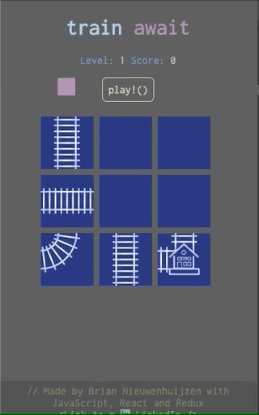

# 🚂 Train Await 🚂

## About this game

In this game the player has to guide the train to the station but the train tracks are all wrong!

Rotate the train tracks by clicking on them. Once all the train tracks are in place press play to make the train move.

If the train travels a longer distance you get a higher score however, rotating the train tracks too much reduces your score. Try finding the optimal route for the highest score possible.

[🚂 Play the game here 🚂](https://train-await.netlify.com/)

## Table of contents

- [Game demo](#game-demo)
- [Technologies used](#technologies-used)
- [Goals for this project](#goals-for-this-project)
- [Workflow](#workflow)

## Game demo

 

## Technologies used

Click on the links to see samples from this project

- [HTML & CSS](https://github.com/BrianBplusplus/Train-Await-Client/blob/master/src/components/Interface/EndScreenContainer.js)
- [JavaScript](https://github.com/BrianBplusplus/Train-Await-Client/blob/master/src/components/Game/functions/playGame.js)
- [React](https://github.com/BrianBplusplus/Train-Await-Client/blob/master/src/components/Game/GameContainer.js)
- [Redux](https://github.com/BrianBplusplus/Train-Await-Client/blob/master/src/store/levels/reducer.js)

## Goals for this project

The goal of this project is to showcase my JavaScript skill by creating a puzzle game and working in an organized fashion.
During this project i focused on:

- practicing correct usage of the more complex features of JavaScript
- combine what i learned in the bootcamp with things i've learned in the past
- practice a disciplined [workflow](#workflow)

## Workflow

During this project i tried to use:

- Good commit messages
- Correctly named branches
- Descriptive [pull requests](https://github.com/BrianBplusplus/Train-Await-Client/pull/5)
- A [Trello board](https://trello.com/b/OakMNP3t/portfolio-project) to keep track of what im doing/still have to do
